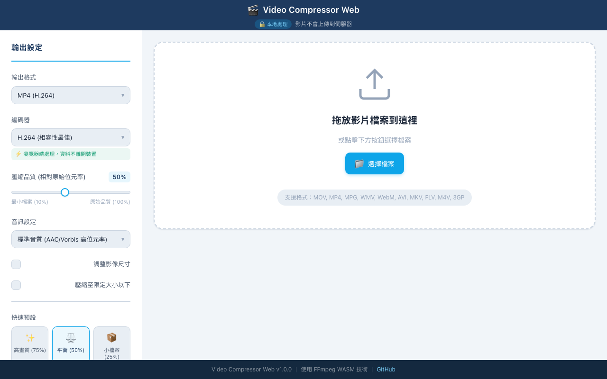

# 🎬 影片壓縮工具（網頁版）使用說明

## 這是什麼？

跨平台網頁版影片壓縮工具，使用 FFmpeg WASM 在瀏覽器內完成壓縮，不上傳檔案。

## 線上使用

**https://miku4ocean.github.io/mac-video-transfer-web/**

## 使用方式

1. 開啟網頁，點擊上傳或拖放影片檔案
2. 選擇壓縮品質（高/中/低）
3. 點擊開始壓縮，等待處理完成
4. 下載壓縮後的影片

## 功能特色

- 純瀏覽器端處理，隱私安全
- FFmpeg WASM 技術，無需安裝軟體
- 支援 mp4、webm、mov 等常見格式
- 即時顯示壓縮進度與預估大小

## 注意事項

- 大檔案壓縮需要較多記憶體與時間
- 建議使用桌機版 Chrome 獲得最佳效能
- 手機瀏覽器可能因記憶體限制無法處理大檔案
